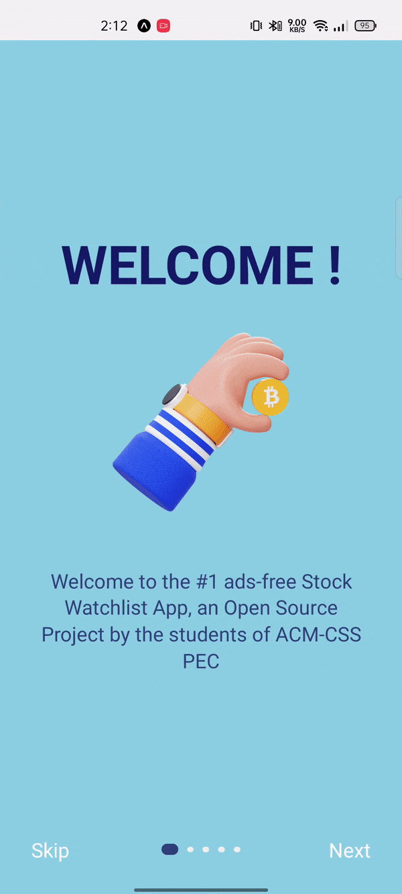
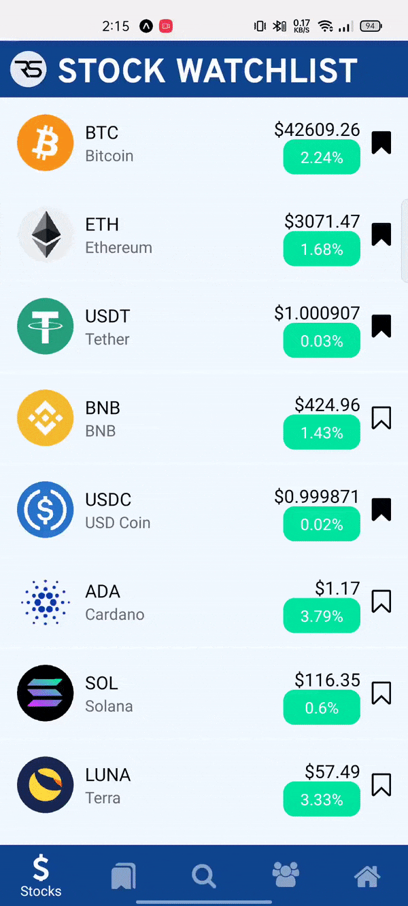
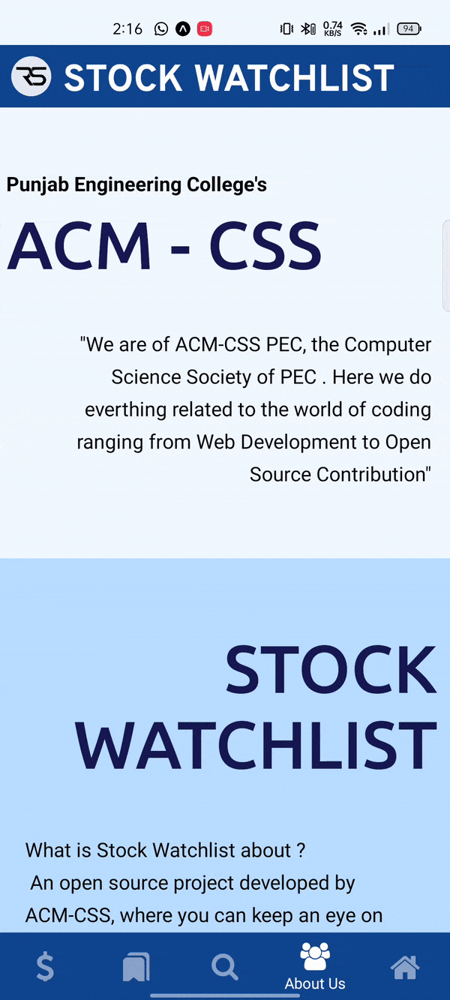
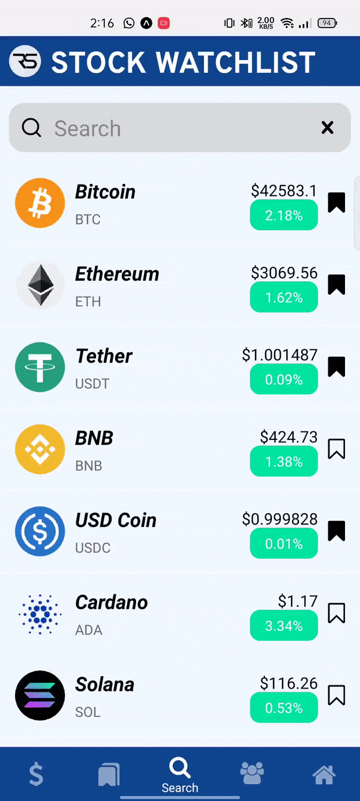

<div id="top"></div>

<!-- PROJECT SHIELDS -->
[![Contributors][contributors-shield]][contributors-url]
[![Forks][forks-shield]][forks-url]
[![Stargazers][stars-shield]][stars-url]
[![Issues][issues-shield]][issues-url]
[![MIT License][license-shield]][license-url]
[![LinkedIn][linkedin-shield]][linkedin-url]

<!-- PROJECT LOGO -->
<br />
<div align="center">
  <a href="https://github.com/PEC-CSS/Stock-Watchlist">
    
  </a>

  <h3 align="center">Stock-Watchlist</h3>

  <p align="center">
    <p>Completly Open-Source | Free To Use | Ad-Free</p>
<p>Asset Watchlist Application for Stocks (NSE & BSE), Cryptocurrencies, Options and Indexes.</p> 
    
  <a href="https://github.com/PEC-CSS/Stock-Watchlist"><strong>Explore the docs »</strong></a>
    <br />
    <a href="https://github.com/PEC-CSS/Stock-Watchlist">View Demo</a>
    ·
    <a href="https://github.com/PEC-CSS/Stock-Watchlist/issues">Report Bug</a>
    ·
    <a href="https://github.com/PEC-CSS/Stock-Watchlist/issues">Request Feature</a>
  </p>
</div>


<!-- TABLE OF CONTENTS -->
<details>
  <summary>Table of Contents</summary>
  <ol>
    <li>
        <a href="#about-the-project">About The Project</a>
        <ul>
          <li><a href="#built-with">Built With</a></li>
        </ul>
      </li>
      <li>
        <a href="#getting-started">Getting Started</a>
        <ul>
          <li><a href="#prerequisites">Prerequisites</a></li>
          <li><a href="#installation">Installation</a></li>
        </ul>
      </li>
      <li><a href="#usage">Usage</a></li>
      <li><a href="#roadmap">Roadmap</a></li>
      <li><a href="#contributing">Contributing</a></li>
      <li><a href="#license">License</a></li>
      <li><a href="#contact">Contact</a></li>
      <li><a href="#acknowledgments">Acknowledgments</a></li>
  </ol>
</details>


<!-- ABOUT THE PROJECT -->
## About The Project

<!-- [![Login Screen Screen Shot][product-screenshot-loginScreen]](https://example.com)
[![Stock Screen And Watchlist Screen Shot][product-screenshot-stockScreenAndWatchlist]](https://example.com)
[![About and Profile Screen Screen Shot][product-screenshot-aboutAndProfileScreen]](https://example.com)
[![Search Screen Screen Shot][product-screenshot-searchScreen]](https://example.com) -->
<p align='middle'>
  
  
  
  
</p>


### Built With
<a href="https://reactnative.dev/"></a> &nbsp; 
<a href="https://expo.dev//"></a> &nbsp;
<a href="https://firebase.google.com///"></a>


<!-- GETTING STARTED -->
## Getting Started

To get a local copy up and running follow these simple example steps.

### Prerequisites

* npm
  ```sh
  npm install npm@latest -g
  ```

### Installation

_Below is an example of how you can install and set up your app._

<!-- 1. Get a free API Key at [https://example.com](https://example.com) -->
1. Clone the repo
   ```sh
   git clone https://github.com/PEC-CSS/Stock-Watchlist.git
   ```
2. Install NPM packages
   ```sh
   npm install
   ```
   or
   ```sh
   npm install --legacy-peer-deps
   ```


<!-- USAGE EXAMPLES -->
## Usage

- Start the project
  ```sh
  npx expo start
  ```
- To see changes:
  - Browser - click on <b>Run in web browser</b> and use <b>'Ctrl+Shift+M'</b> to toggle mobile view
  - Mobile - Scan the QR Code. (make sure Expo Go app is installed on your phone)
- Create a new build
  ```sh
  eas build --profile preview --platform android
  ```

_For more examples, please refer to the [Documentation](https://example.com)_


<!-- ROADMAP -->
<!-- ## Roadmap

- [x] Add Changelog
- [x] Add back to top links
- [ ] Add Additional Templates w/ Examples
- [ ] Add "components" document to easily copy & paste sections of the readme
- [ ] Multi-language Support
    - [ ] Chinese
    - [ ] Spanish -->
<!-- CONTRIBUTORS -->
## Contributors
This project exists thanks to all the people who contribute. [<a href="#contributing">Contributing</a>].

<a href="https://github.com/PEC-CSS/Stock-Watchlist/graphs/contributors">
  
</a>

See the [open issues](https://github.com/PEC-CSS/Stock-Watchlist/issues) for a full list of proposed features (and known issues).


<!-- CONTRIBUTING -->
## Contributing

Contributions are what make the open source community such an amazing place to learn, inspire, and create. Any contributions you make are **greatly appreciated**.

If you have a suggestion that would make this better, please fork the repo and create a pull request. You can also simply open an issue with the tag "enhancement".

Be sure to read the [contribution guidelines](CONTRIBUTING.md) before contributing.

Follow below steps to make your contribution count.

## 🖱️ How to Contribute 

If you think that you can add a new feature or want to fix a bug, we invite you to contribute to Stock-Watchlist and make this project better. To start contributing, follow the below instructions:

1. Create a folder at your desire location (usually at your desktop).

2. Open Git Bash Here


3. [Fork](https://github.com/PEC-CSS/Stock-Watchlist) the project. Click on the <a href="https://github.com/PEC-CSS/Stock-Watchlist/fork"></a> icon in the top right to get started.

4. Clone your forked repository of project.

```bash
git clone https://github.com/PEC-CSS/Stock-Watchlist.git
```

5. Navigate to the project directory.

```bash
cd Stock-Watchlist
```

6. Add a reference(remote) to the original repository.

```bash
git remote add upstream https://github.com/PEC-CSS/Stock-Watchlist.git
```

7. Check the remotes for this repository.

```bash
git remote -v
```

8. Always take a pull from the upstream repository to your main branch to keep it updated as per the main project repository.

```bash
git pull upstream main
```

9. Create a new branch(prefer a branch name that relates to your assigned issue).

```bash
git checkout -b <YOUR_BRANCH_NAME>
```

10. Perform your desired changes to the code base.

11. Check your changes.

```bash
git status
```

```bash
git  diff
```

12. Stage your changes.

```bash
git add . <\files_that_you_made_changes>
```

13. Commit your changes.

```bash
git commit -m "Commit Message"
```

14. Push the committed changes in your feature branch to your remote repository.

```bash
git push -u origin <your_branch_name>
```

15. To create a pull request, click on `compare and pull requests`.

16. Add an appropriate title and description to your PR explaining your changes.

17. Click on `Create pull request`.

Congratulations🎉, you have made a PR to the Stock-Watchlist.
Wait for your submission to be accepted and your PR to be merged by a maintainer.

## 🫴 How to Do Your First Pull Request?  
   ***(We are providing some Resource from where you can Learn)***

1. [Learn from Video](https://www.youtube.com/watch?v=nkuYH40cjo4)
2. [Open Source Guide](https://opensource.guide/how-to-contribute/)

## Code of Conduct

- [Code of Conduct](CODE_OF_CONDUCT.md)

## 🙏🏽 Support

This project needs a star️ from you. Don't forget to leave a star✨
Follow my Github for content
<br>
<br>
<hr>
<h6 align="center">© PEC ACM CSS
<br>

<!-- LICENSE -->
## License

Distributed under the MIT License. See [LICENSE](LICENSE) for more information.

<!-- CONTACT -->
## Contact

[Rahul Sharma](https://rahulsharma.vercel.app/) - acmcss@pec.edu.in - rahul2702sharma@gmail.com

Project Link: [https://github.com/PEC-CSS/Stock-Watchlist](https://github.com/PEC-CSS/Stock-Watchlist)

<!-- ACKNOWLEDGMENTS -->
## Acknowledgments

Use this space to list resources you find helpful and would like to give credit to. I've included a few of my favorites to kick things off!

* [React Native docs](https://reactnative.dev/docs/getting-started)
* [Expo Docs](https://docs.expo.dev/)
* [Messari API](https://messari.io/api)
* [Let's build Tinder 2.0 with REACT NATIVE! (Messaging, ContextAPI, Tailwind, Google Auth, Firebase)](https://www.youtube.com/watch?v=qJaFIGjyRms)
* [Img Shields](https://shields.io)
* [othneildrew / Best-README-Template](https://github.com/othneildrew/Best-README-Template)

<p align="right">(<a href="#top">back to top</a>)</p>


<!-- MARKDOWN LINKS & IMAGES -->
<!-- https://www.markdownguide.org/basic-syntax/#reference-style-links -->
[contributors-shield]: https://img.shields.io:/github/contributors/PEC-CSS/Stock-Watchlist?style=for-the-badge
[contributors-url]: https://github.com/PEC-CSS/Stock-Watchlist/graphs/contributors
[forks-shield]: https://img.shields.io/github/forks/PEC-CSS/Stock-Watchlist?style=for-the-badge
[forks-url]: https://github.com/PEC-CSS/Stock-Watchlist/network/members
[stars-shield]: https://img.shields.io/github/stars/PEC-CSS/Stock-Watchlist?style=for-the-badge
[stars-url]: https://github.com/PEC-CSS/Stock-Watchlist/stargazers
[issues-shield]: https://img.shields.io/github/issues/PEC-CSS/Stock-Watchlist?style=for-the-badge
[issues-url]: https://github.com/PEC-CSS/Stock-Watchlist/issues
[license-shield]: https://img.shields.io/github/license/PEC-CSS/Stock-Watchlist?style=for-the-badge
[license-url]: https://github.com/PEC-CSS/Stock-Watchlist/blob/master/LICENSE.txt
[linkedin-shield]: https://img.shields.io/badge/-LinkedIn-black.svg?style=for-the-badge&logo=linkedin&colorB=555
[linkedin-url]: https://www.linkedin.com/in/rahul5430/
[product-screenshot-loginScreen]: assets/loginScreen.gif
[product-screenshot-stockScreenAndWatchlist]: assets/stockScreenAndWatchlist.gif
[product-screenshot-aboutAndProfileScreen]: assets/aboutAndProfileScreen.gif
[product-screenshot-searchScreen]: assets/searchScreen.gif
